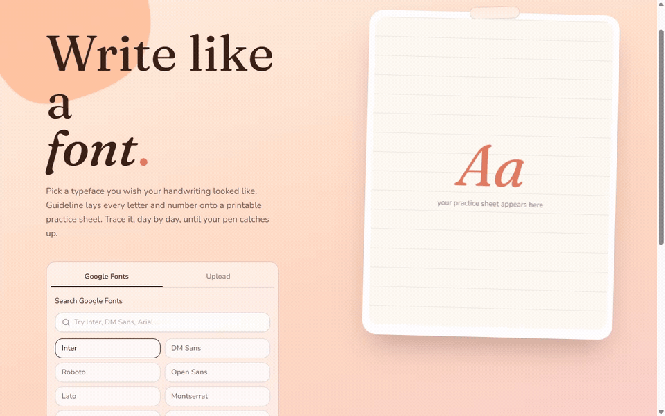
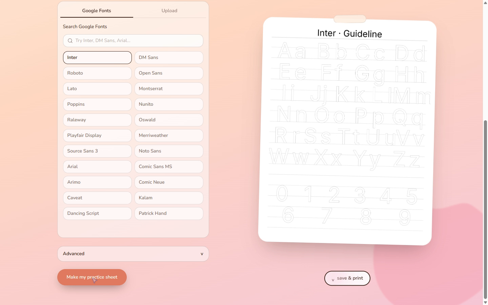

# Guideline

Generate printable handwriting practice sheets from a Google Font or an uploaded font file.

## Demo



Choosing Caveat and generating a printable practice sheet.

<details>
<summary>Screenshot</summary>



</details>

[Live demo](https://tracing-sheet-generator.vercel.app)

## What it does

- Search Google Fonts or upload a `.ttf` or `.otf` file.
- Choose solid or dotted glyph outlines.
- Adjust dot density and glyph thickness.
- Preview and download the generated PNG sheet at 300 DPI.

## Run locally

Use Node.js 20.9+ and Bun.

```bash
git clone https://github.com/SpyC0der77/guideline.git
cd guideline
bun install --frozen-lockfile
bun run dev
```

Open [localhost:3000](http://localhost:3000).

## Commands

| Command | Purpose |
| --- | --- |
| `bun run dev` | Start the development server |
| `bun run build` | Build the production app |
| `bun run start` | Serve a production build |
| `bun run lint` | Run ESLint |

Run `build` before `start`.

## Dependencies and limitations

Sheet generation runs on the server with `@napi-rs/canvas` and `fontkit`. Google Font selection requires network access; uploaded fonts provide an alternative. Deploy on a Node.js runtime that supports the canvas native dependency.

## Source layout

- [`app/page.tsx`](app/page.tsx): Font picker, settings, preview, and download.
- [`app/api/guideline/route.ts`](app/api/guideline/route.ts): Sheet generation endpoint.
- [`app/api/google-fonts/route.ts`](app/api/google-fonts/route.ts): Font search endpoint.
- [`lib/`](lib/): Font loading and sheet generation helpers.
